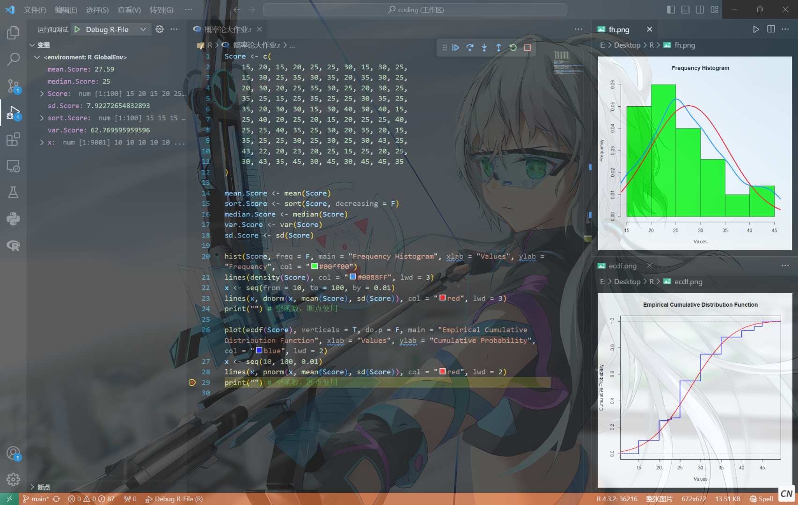
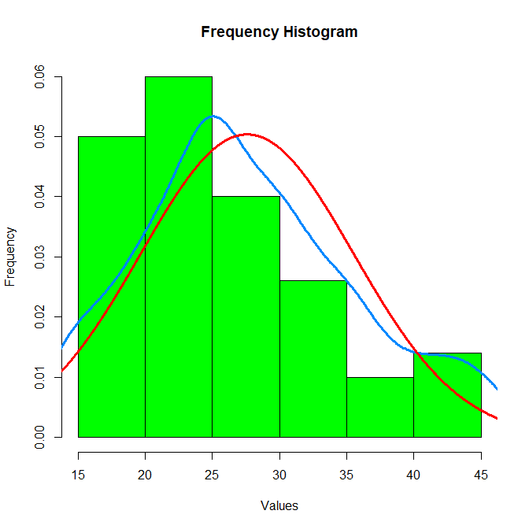
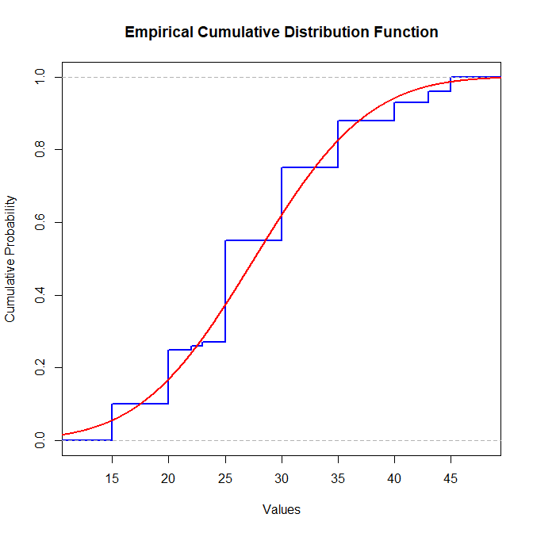

## 一、实验内容

1. 选择一组有意义的数据（不少于30个）或采用习题6中第4题数据；
2. 计算该组数据的样本均值、顺序统计量、样本中位数、样本方差、样本标准差；
3. 绘出频率直方图，经验分布函数图并进行简单分析说明.

## 二、准备工作

### 2.1 环境搭建

- 编程语言：[R Language](https://www.r-project.org/)

- 集成开发环境（IDE）：[Visual Studio Code](https://code.visualstudio.com/)

<div style="margin: 0 auto; text-align: center; width: 80%">

实验环境总览
</div>

### 2.2 数据选取

根据题目要求，本实验选择习题6中第4题数据，数据内容如下：

  |  -   |  -   |  -   |  -   |  -   |  -   |  -   |  -   |  -   |  -   |
  | :--: | :--: | :--: | :--: | :--: | :--: | :--: | :--: | :--: | :--: |
  |  15  |  20  |  15  |  20  |  25  |  25  |  30  |  15  |  30  |  25  |
  |  15  |  30  |  25  |  35  |  30  |  35  |  20  |  35  |  30  |  25  |
  |  20  |  30  |  20  |  25  |  35  |  30  |  25  |  20  |  30  |  25  |
  |  35  |  25  |  15  |  25  |  35  |  25  |  25  |  30  |  35  |  25  |
  |  35  |  20  |  30  |  30  |  15  |  30  |  40  |  30  |  40  |  15  |
  |  25  |  40  |  20  |  25  |  20  |  15  |  20  |  25  |  25  |  40  |
  |  25  |  25  |  40  |  35  |  25  |  30  |  20  |  35  |  20  |  15  |
  |  35  |  25  |  25  |  30  |  25  |  30  |  25  |  30  |  43  |  25  |
  |  43  |  22  |  20  |  23  |  20  |  25  |  15  |  25  |  20  |  25  |
  |  30  |  43  |  35  |  45  |  30  |  45  |  30  |  45  |  45  |  35  |

## 三、实验主要步骤及结论

### 3.1 实验代码编写

实验中编写了如下图所示的代码

```R
Score <- c(
    15, 20, 15, 20, 25, 25, 30, 15, 30, 25,
    15, 30, 25, 35, 30, 35, 20, 35, 30, 25,
    20, 30, 20, 25, 35, 30, 25, 20, 30, 25,
    35, 25, 15, 25, 35, 25, 25, 30, 35, 25,
    35, 20, 30, 30, 15, 30, 40, 30, 40, 15,
    25, 40, 20, 25, 20, 15, 20, 25, 25, 40,
    25, 25, 40, 35, 25, 30, 20, 35, 20, 15,
    35, 25, 25, 30, 25, 30, 25, 30, 43, 25,
    43, 22, 20, 23, 20, 25, 15, 25, 20, 25,
    30, 43, 35, 45, 30, 45, 30, 45, 45, 35
)

mean.Score <- mean(Score)
sort.Score <- sort(Score, decreasing = F)
median.Score <- median(Score)
var.Score <- var(Score)
sd.Score <- sd(Score)

hist(Score, freq = F, main = "Frequency Histogram", xlab = "Values", ylab = "Frequency", col = "#00ff00")
lines(density(Score), col = "#0088FF", lwd = 3)
x <- seq(from = 10, to = 100, by = 0.01)
lines(x, dnorm(x, mean(Score), sd(Score)), col = "red", lwd = 3)
print("") # 空函数，断点使用

plot(ecdf(Score), verticals = T, do.p = F, main = "Empirical Cumulative Distribution Function", xlab = "Values", ylab = "Cumulative Probability", col = "blue", lwd = 2)
x <- seq(10, 100, 0.01)
lines(x, pnorm(x, mean(Score), sd(Score)), col = "red", lwd = 2)
print("") # 空函数，断点使用
```

### 3.2 运行程序

使用R软件运行上述程序，得到运行结果列表如下：

|   VARIABLES    |                    VALUES                     |
| :------------: | :-------------------------------------------: |
|  `mean.Score`  |                     27.59                     |
| `median.Score` |                      25                       |
|    `Score`     | num [1:100] 15 20 15 20 25 25 30 15 30 25 ... |
|   `sd.Score`   |               7.92272654832893                |
|  `sort.Score`  | num [1:100] 15 15 15 15 15 15 15 15 15 15 ... |
|  `var.Score`   |                62.769595959596                |
|      `x`       |        num [1:9001] 10 10 10 10 10 ...        |

根据命令绘制成的图表如下所示：

<div style="margin: 0 auto; text-align: center; width: 60%">

Frequency Histogram
</div>

<div style="margin: 0 auto; text-align: center; width: 60%">

Empirical Cumulative Distribution Function
</div>

### 3.3 数据分析和实验结论

**由上述数据值可以得到如下结论：**

- 该组数据的样本平均值为：27.59；

- 样本中位数为：25；

- 样本方差为：62.77；

- 样本标准差为：7.927；

- 样本顺序统计量如下表所示：

  |  -   |  -   |  -   |  -   |  -   |  -   |  -   |  -   |  -   |  -   |
  | :--: | :--: | :--: | :--: | :--: | :--: | :--: | :--: | :--: | :--: |
  |  15  |  15  |  15  |  15  |  15  |  15  |  15  |  15  |  15  |  15  |
  |  20  |  20  |  20  |  20  |  20  |  20  |  20  |  20  |  20  |  20  |
  |  20  |  20  |  20  |  20  |  20  |  22  |  23  |  25  |  25  |  25  |
  |  25  |  25  |  25  |  25  |  25  |  25  |  25  |  25  |  25  |  25  |
  |  25  |  25  |  25  |  25  |  25  |  25  |  25  |  25  |  25  |  25  |
  |  25  |  25  |  25  |  25  |  25  |  30  |  30  |  30  |  30  |  30  |
  |  30  |  30  |  30  |  30  |  30  |  30  |  30  |  30  |  30  |  30  |
  |  30  |  30  |  30  |  30  |  30  |  35  |  35  |  35  |  35  |  35  |
  |  35  |  35  |  35  |  35  |  35  |  35  |  35  |  35  |  40  |  40  |
  |  40  |  40  |  40  |  43  |  43  |  43  |  45  |  45  |  45  |  45  |

**进一步对数据进行分析可得：**

1. 峰值的高度显示了数据点在这些峰值附近的集中度。数据点越密集的地方，峰值就越高。直方图中，`15-20`、`20-25`和`25-30`的位置有很高的柱，说明数据点在这些位置有很多。

2. 数据值分布相对广泛，故数据的离散性相对较高。

3. 经验分布函数图显示，数据值的累积随着数值的增长而增长，但不是完全符合正态分布的形状。这说明数据的分布有一些偏离正态分布的倾向。
