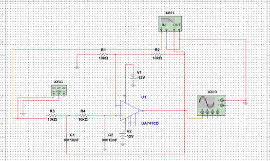
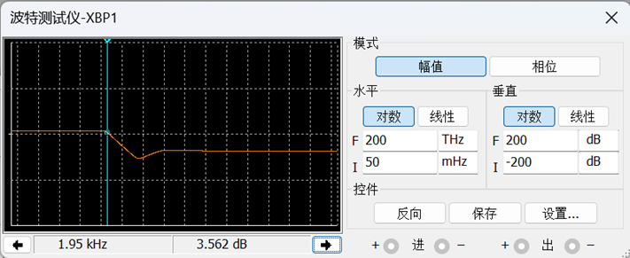
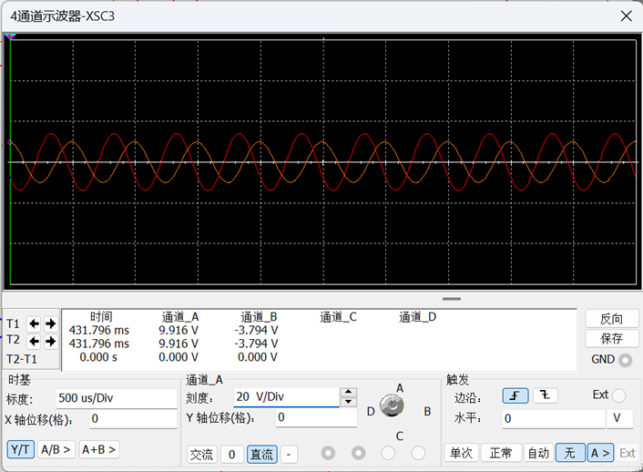
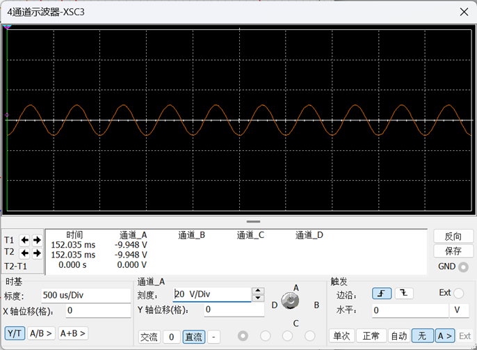
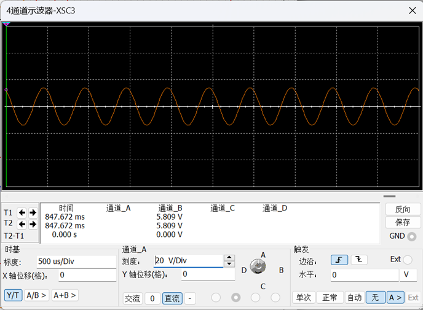

## 一种二阶压控型低通滤波器的设计

### 一、实验要求

设计一个二阶压控型低通滤波器，要求通带增益为 2，截止频率为 2kHz，可以选择 0.01μF 的电容器，阻值尽量接近实际计算值。电路设计完后，画出频率响应曲线，并采用 Multisim 软件进行仿真分析。

### 二、电路设计

### 三、参数计算

1. 低通滤波器在通带将内电容视为开路，给电路引入负反馈从而满足“虚短”“虚断”，通带增益：\[{{A}_{\text{up}}}=1+\frac{{{R}_{3}}}{{{R}_{4}}}=2\]则：\[{{R}_{3}}={{R}_{4}}\]取：\[{{R}_{3}}={{R}_{4}}=10k\Omega \]

2. 传递函数：\[{{A}_{u}}(s)=\frac{{{U}_{o}}(s)}{{{U}_{i}}(s)}=\frac{1}{1+(3-{{A}_{\text{up}}})sCR+{{(sCR)}^{2}}}{{A}_{\text{up}}}\]令\[s=j\omega \]得滤波器的频率响应表达式：\[{{\dot{A}}_{\text{u}}}=\frac{{{A}_{\text{up}}}}{1-{{(\frac{f}{{{f}_{0}}})}^{2}}+j(3-{{A}_{\text{up}}})\frac{f}{{{f}_{0}}}}\]其中：\[{{f}_{0}}=\frac{1}{2\pi RC}\]

3. 当\[f\]为截止频率时， \[\left| 1-{{(\frac{{{f}_{H}}}{{{f}_{0}}})}^{2}}+j(3-{{A}_{\text{up}}})\frac{{{f}_{H}}}{{{f}_{0}}} \right|=\sqrt{2}\]解得该滤波器的上限截止频率为：\[{{f}_{H}}=\sqrt{\frac{1+\sqrt{5}}{2}}{{f}_{0}}\approx 1.27{{f}_{0}}\]定义有源低通滤波器的品质因数：\[Q\]为：\[f={{f}_{0}}\]时电压放大倍数的模与通带电压放大倍数之比，即：\[Q=\frac{1}{3-{{A}_{up}}}\]加之以实验设计需求：\[{{A}_{\text{up}}}=2\]\[{{f}_{H}}=2kHz\]计算可取：\[{{R}_{1}}={{R}_{2}}=10k\Omega \]\[C=10nF\] \[{{R}_{3}}={{R}_{4}}=10k\Omega \]

### 四、仿真分析

运用 Multisim 软件对上述实验设计思路进行仿真分析。结果如下：

由仿真结果可以得到电路的幅频特性，且可知截止频率为 1.95kHz，近似为 2KHz，符合试验设计要求。

其中，通道 A，B 的波形分别为：

### 五、实验收获

本次实验让我对运算放大器的非线性应用有了更深的理解，巩固了模拟电路设计的基本方法，通过对电路的设计与调试，逐渐熟悉了软件`Multisim`的使用，掌握了直流分析与频率响应分析的技巧，为以后的学习打下了坚实的基础。

### 六、参考文献

[1]曹涛.电子应用开发中电子电路仿真技术的作用分析[J].电子元器件与信息技术,2023,7(03):29-31+40.DOI:10.19772/j.cnki.2096-4455.2023.3.007.

[2]陆国强.电力电子电路故障预测技术分析[J].电子元器件与信息技术,2021,5(09):51-52+65.DOI:10.19772/j.cnki.2096-4455.2021.9.023.
