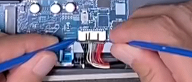
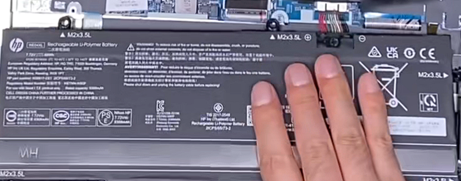
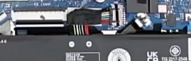
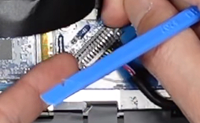
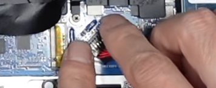
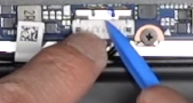
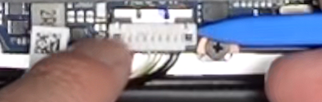

教程来自群友 **@灌注频道喵，灌注频道谢谢喵！**

本文的目的是总结目前市面上已有的电池排线接口。

<!-- more -->

## 前言

笔记本在进行拆装硬盘、清灰等操作前，为了保障主板上的元器件的安全，都要进行拆除电池排线、放静电的步骤，但不同的笔记本厂商所采用的电池排线接口不同，甚至同一厂商不同机型或是同一机型不同代的电池排线都不一样（华硕天选2与天选3），因此，许多拆机新手在面对一些古怪的排线时，往往急的挠头（bushi），本文的目的便是总结目前市面上已有的电池排线接口，便于大家更好的完成拆机工作。

::: warning
**重要：未拆过机，没有一定动手能力的同学，请勿独自尝试！！！**
:::

## 直接拔出型（联想，神船，机革，惠普等大部分机型）

针对这种类型的电池排线接口，我们可以使用撬棒或手将排线拔出，在拔排线时注意电池接口旁的电容或电阻，不要碰到即可。若第一次拔时较紧，可以左右小幅度摇晃并同时向后拉，即可将排线拉出。

## 拆除电池型（少数惠普轻薄本或其他笔记本）

针对这种类型的笔记本，它的电池排线可能较短或是电池排线用塑胶固定，导致排线较硬无法弯曲。我们因此只能将电池的螺丝取下，将电池拆开，通过拔出电池，带动排线，进而将电池排线拔除。

## 垂直直拔型（thinkbook系列）

这种笔记本的电池排线设计是与一般的插口垂直90度的，同时在转角处用黑胶覆盖。针对这种排线直接握住转角处，向外拔即可。在拔排线时注意电池接口旁的电容或电阻，不要碰到即可。若第一次拔时较紧，可以左右小幅度摇晃并同时向后拉，即可将排线拉出。

## 斜挂前推型（荣耀magicbook系列）

这种笔记本的排线较为复杂，首先需要将接口旁的两个耳朵向上竖起来拉，直到耳朵完全拉直，随后将电池排线沿接口方向前上推，即可将排线取出。

安装排线时，则需要将排线对准接口，同时两只手指按住排线左右两端，将卡扣按下去，即可安装完成。

<table><tr>
<td></td>
<td></td>
</tr></table>

## 铁片上拔型（华硕天选、rog系列）

这种电池排线的结构更加复杂，使用了一个铁片对排线进行固定，在拆卸时需要先将铁片往前顶，随后将电池向上扣除。注意在顶铁片的时候不要太用力，防止手滑顶到主板上的其他元器件。

在安装时，先将电池排线向下压紧，然后将铁片向后拉即可。

<table><tr>
<td></td>
<td></td>
</tr></table>

::: danger
这种类型的电池排线上的铁片稍不注意便会弹飞，导致包括但不限于**电路板短路烧毁**、**各种芯片甚至核心击穿**等严重问题，如无经验，切勿上手拆卸！！！
:::
