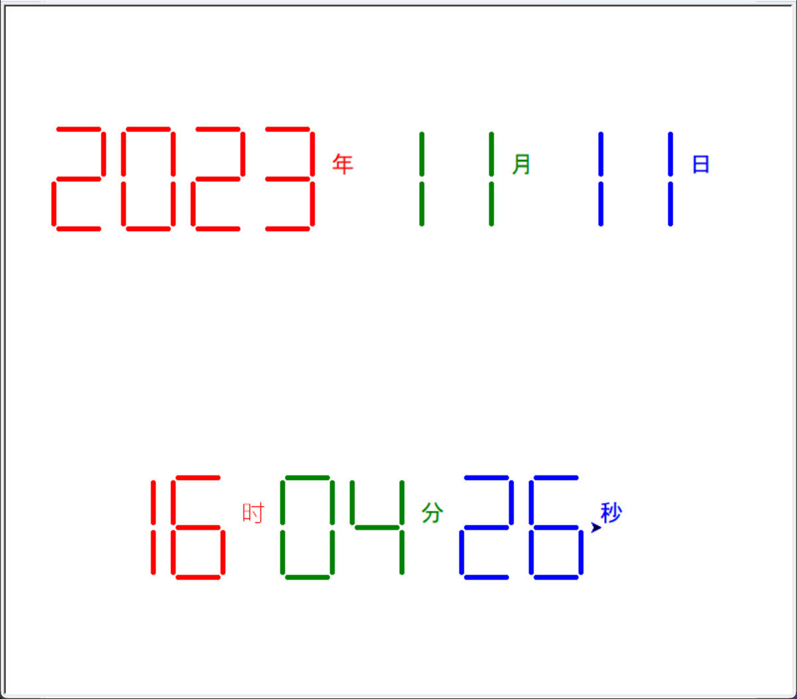

## 一、实验目的

1. 掌握函数的定义和调用方法

2. 掌握列表的定义及操作方法

3. 掌握元组的定义及操作方法

4. 掌握集合的定义及操作方法

## 二、实验内容

1. 参考教材的例程`e7.2DrawSevenSegDisplay.py`，在理解该程序的基础上增加“xx时xx分xx秒”的显示功能，建议使用自己喜欢的颜色和线宽去绘制。

2. 重复元素判定：编写一个函数，输入参数是列表类型，在函数中判断列表中有没有重复元素。输入多个字符串，调用函数并验证功能。

3. 重复元素判定续：利用集合中元素的无重复性改写程序（2），获得一个更快更简明的版本。

4. 重复元素判定再续：在程序（2）的基础上，基于“元组”实现对重复次数的统计。打印出所有的出现次数>1的元素和出现次数，及输入次序。

## 三、实验程序/结果/注释

### 3.1 数码管绘制

参考教材的例程`e7.2DrawSevenSegDisplay.py`，在理解该程序的基础上增加“xx时xx分xx秒”的显示功能，建议使用自己喜欢的颜色和线宽去绘制。

实验代码如下：

```python
import datetime
import turtle


def drawGap():  # 绘制数码管间隔
    turtle.penup()
    turtle.fd(5)


def drawLine(draw):  # 绘制单段数码管
    drawGap()
    turtle.pendown() if draw else turtle.penup()
    turtle.fd(40)
    drawGap()
    turtle.right(90)


def drawDigit(d):  # 根据数字绘制七段数码管
    drawLine(True) if d in [2, 3, 4, 5, 6, 8, 9] else drawLine(False)
    drawLine(True) if d in [0, 1, 3, 4, 5, 6, 7, 8, 9] else drawLine(False)
    drawLine(True) if d in [0, 2, 3, 5, 6, 8, 9] else drawLine(False)
    drawLine(True) if d in [0, 2, 6, 8] else drawLine(False)
    turtle.left(90)
    drawLine(True) if d in [0, 4, 5, 6, 8, 9] else drawLine(False)
    drawLine(True) if d in [0, 2, 3, 5, 6, 7, 8, 9] else drawLine(False)
    drawLine(True) if d in [0, 1, 2, 3, 4, 7, 8, 9] else drawLine(False)
    turtle.left(180)
    turtle.penup()
    turtle.fd(20)


def drawDate(date):
    turtle.pencolor("red")
    for i in date:
        if i == "-":
            turtle.write("年", font=("Arial", 18, "normal"))
            turtle.pencolor("green")
            turtle.fd(40)
        elif i == "=":
            turtle.write("月", font=("Arial", 18, "normal"))
            turtle.pencolor("blue")
            turtle.fd(40)
        elif i == "+":
            turtle.write("日", font=("Arial", 18, "normal"))
        else:
            drawDigit(eval(i))


def drawTime(time):
    turtle.pencolor("red")
    for i in time:
        if i == "-":
            turtle.write("时", font=("Arial", 18, "normal"))
            turtle.pencolor("green")
            turtle.fd(40)
        elif i == "=":
            turtle.write("分", font=("Arial", 18, "normal"))
            turtle.pencolor("blue")
            turtle.fd(40)
        elif i == "+":
            turtle.write("秒", font=("Arial", 18, "normal"))
        else:
            drawDigit(eval(i))


def main():
    turtle.speed(0)
    turtle.setup(800, 700)
    turtle.penup()
    turtle.goto(-350, 175)
    turtle.seth(0)
    turtle.pensize(5)
    drawDate(datetime.datetime.now().strftime("%Y-%m=%d+"))
    turtle.goto(-300, -175)
    drawTime(datetime.datetime.now().strftime("%H-%M=%S+"))
    turtle.hideturtle()


main()

```

运行程序，程序输出如下图：

<div style="margin: 0 auto; text-align: center; width: 60%">

程序运行结果
</div>

### 3.2 重复元素判定

编写一个函数，输入参数是列表类型，在函数中判断列表中有没有重复元素。输入多个字符串，调用函数并验证功能。

实验代码如下：

```python
def main():
    num = []
    n = input("请输入一个字符串 或者直接按回车结束程序")
    while n != "":
        num.append(n)
        n = input("请输入一个字符串 或者直接按回车结束程序")
    else:
        print("正在处理，请稍等")
        judge(num)


def judge(n):
    count = 0
    for i in range(len(n)):
        if n[i] in n[i + 1 :]:
            count += 1
        else:
            pass
    if count == 0:
        print("鉴定完毕，没有重复的元素")
    else:
        print("有重复的元素，总共有{}个".format(count))


main()
```

运行程序，分别输入：`a,a,a,b,b,c` ，程序输出如下：

```text
请输入一个字符串 或者直接按回车结束程序a
请输入一个字符串 或者直接按回车结束程序a
请输入一个字符串 或者直接按回车结束程序a
请输入一个字符串 或者直接按回车结束程序b
请输入一个字符串 或者直接按回车结束程序b
请输入一个字符串 或者直接按回车结束程序c
请输入一个字符串 或者直接按回车结束程序
正在处理，请稍等
有重复的元素，总共有3个
```

输入中重复的元素分别是：`a`  `a` `b` ，共三个，符合题目要求。

### 3.3 重复元素判定续

利用集合中元素的无重复性改写程序3.2，获得一个更快更简明的版本。

实验代码如下：

```python
def main():
    num = []
    n = input("请输入一个字符串 或者直接按回车结束程序")
    while n != "":
        num.append(n)
        n = input("请输入一个字符串 或者直接按回车结束程序")
    else:
        print("正在处理，请稍等")
        judge(num)


def judge(n):
    if len(n) == len(set(n)):
        print("鉴定完毕，没有重复的元素")
    else:
        print("有重复的元素，总共有{}个".format(len(n) - len(set(n))))


main()
```

运行程序，分别输入输入：`80` `80` `80` `100` `100` `a` `a` `b` `c` `d` `e` ，程序输出如下：

```text
输入一个字符串 或者直接按回车结束程序80
请输入一个字符串 或者直接按回车结束程序80
请输入一个字符串 或者直接按回车结束程序80
请输入一个字符串 或者直接按回车结束程序100
请输入一个字符串 或者直接按回车结束程序100
请输入一个字符串 或者直接按回车结束程序a
请输入一个字符串 或者直接按回车结束程序a
请输入一个字符串 或者直接按回车结束程序b
请输入一个字符串 或者直接按回车结束程序c
请输入一个字符串 或者直接按回车结束程序d
请输入一个字符串 或者直接按回车结束程序e
请输入一个字符串 或者直接按回车结束程序
正在处理，请稍等
有重复的元素，总共有4个
```

输入中重复的元素分别是：`80`  `80` `100` `a` ，共四个，符合题目要求。

### 3.4 重复元素判定再续

在程序3.3的基础上，基于“元组”实现对重复次数的统计。打印出所有的出现次数>1的元素和出现次数，及输入次序。

实验代码如下：

```python
def main():
    num = ()
    n = tuple(input("请输入一个字符串 或者直接按回车结束程序"))
    while len(n) != 0:
        num += n
        n = tuple(input("请输入一个字符串 或者直接按回车结束程序"))
    else:
        print("正在处理，请稍等")
        judge(num)


def judge(n):
    if len(n) == len(set(n)):
        print("鉴定完毕，没有重复的元素")
    else:
        print("有重复的元素，总共有{}个".format(len(n) - len(set(n))))

    for element in set(n):
        count = 0
        position = []
        for i in range(len(n)):
            if element == n[i]:
                count += 1
                position.append(i + 1)
            else:
                pass
        if count > 1:
            print(
                "字符串{}，出现{}次，输入次序分别为：{}".format(element, 
                                                count - 1, str(position)[1:-1])
            )


main()

```

运行程序，分别输入输入：`a,a,a,a,b,b,b,c,c,d` ，程序输出如下：

```text
请输入一个字符串 或者直接按回车结束程序a
请输入一个字符串 或者直接按回车结束程序a
请输入一个字符串 或者直接按回车结束程序a
请输入一个字符串 或者直接按回车结束程序a
请输入一个字符串 或者直接按回车结束程序b
请输入一个字符串 或者直接按回车结束程序b
请输入一个字符串 或者直接按回车结束程序b
请输入一个字符串 或者直接按回车结束程序c
请输入一个字符串 或者直接按回车结束程序c
请输入一个字符串 或者直接按回车结束程序d
请输入一个字符串 或者直接按回车结束程序
正在处理，请稍等
有重复的元素，总共有6个
字符串a，出现4次，输入次序分别为：1, 2, 3, 4
字符串c，出现2次，输入次序分别为：8, 9
字符串b，出现3次，输入次序分别为：5, 6, 7
```

可以观察到重复数量统计，重复元素及其对应的出现次数（这里不是重复次数）、输入次序均正确。
